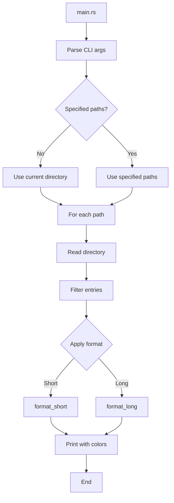

# EKA - Architecture Plan

## 1. Project Vision

**Eka** is a modern replacement for the `ls` command written in Rust, designed to display files and directories in a more user-friendly format with distinctive colors.

## 2. Functional Requirements

### 2.1 Supported Flags

| Flag | Description |
|------|-------------|
| `-l`, `--long` | Long format with columns (permissions, size, date, name) |
| `-d`, `--directories` | List directories only |
| `-a`, `--all` | Show hidden files (starting with `.`) |
| `-h`, `--human-readable` | Display sizes in human-readable format (KB, MB, GB) |
| `<path>` | Directory to list (default: current directory) |

### 2.2 Output Formats

#### Short Format (default)
- Displays file/directory names in a vertical list
- Color-coded by file type
- Sorted alphabetically

#### Long Format (`-l`)
```
-rw-r--r--  1 alex  staff   1.2K Feb 28 10:30 README.md
drwxr-xr-x  2 alex  staff   4.0K Feb 28 09:15 src/
-rwxr-xr-x  1 alex  staff   2.4M Feb 28 10:00 script.sh
```
Columns: permissions | links | user | group | size | date | name

### 2.3 Color System

Customized distinctive colors for each type:

| Type | Color | Description |
|------|-------|-------------|
| Directory | Cyan (#06B6D4) | Directories |
| Executable | Bright Green (#22C55E) | Executable files |
| Regular File | White (#F8FAFC) | Text files, etc. |
| Hidden File | Dark Gray (#64748B) | Files starting with `.` |
| Symlink | Yellow (#EAB308) | Symbolic links |
| Image File | Magenta (#D946EF) | jpg, png, gif, etc. |
| Video File | Red (#EF4444) | mp4, mov, avi, etc. |
| Audio File | Orange (#F97316) | mp3, wav, flac, etc. |
| Compressed File | Purple (#A855F7) | zip, tar, gz, etc. |

## 3. Project Structure

```
eka/
├── Cargo.toml
├── src/
│   ├── main.rs           # Entry point
│   ├── cli.rs            # CLI argument definitions
│   ├── directory.rs      # Directory reading and processing
│   ├── formatter.rs      # Output formatters (short and long)
│   ├── colors.rs         # ANSI color system
│   └── types.rs          # Data types and structures
```

## 4. Dependencies

### Cargo.toml

```toml
[package]
name = "eka"
version = "0.1.0"
edition = "2024"

[dependencies]
clap = { version = "4.5", features = ["derive"] }
chrono = "0.4"           # For date formatting
```

**Note:** We will use direct ANSI codes for colors (no external dependency) to keep the binary small.

## 5. Component Design

### 5.1 CLI (cli.rs)

```rust
// Main argument structure
struct Args {
    long: bool,           // -l
    directories: bool,   // -d
    all: bool,           // -a
    human_readable: bool, // -h
    paths: Vec<String>,  // Paths to list
}
```

### 5.2 Types (types.rs)

```rust
// File information
struct FileEntry {
    name: String,
    path: PathBuf,
    file_type: FileType,
    size: u64,
    permissions: String,
    modified: SystemTime,
    is_hidden: bool,
}

// File types
enum FileType {
    Directory,
    Executable,
    Symlink,
    Image,
    Video,
    Audio,
    Compressed,
    Regular,
}
```

### 5.3 Directory (directory.rs)

- `read_directory(path: &str) -> Vec<FileEntry>`
- Filters entries according to flags
- Classifies files by type
- Sorts alphabetically

### 5.4 Colors (colors.rs)

```rust
// ANSI color codes
const COLORS: &[(FileType, &str)] = [
    (Directory, "\x1b[36m"),    // Cyan
    (Executable, "\x1b[32m"),  // Green
    // ...
];

fn get_color(file_type: FileType) -> &str
fn print_with_color(text: &str, file_type: FileType)
```

### 5.5 Formatter (formatter.rs)

- `format_short(entries: &[FileEntry])` - Simple vertical list
- `format_long(entries: &[FileEntry], human_readable: bool)` - Column format

## 6. Execution Flow



## 7. Usage Examples

```bash
# List current directory (short format with colors)
eka

# List with long format
eka -l

# List only directories
eka -d

# List including hidden files
eka -a

# Long format with human-readable sizes
eka -lh

# List specific directory
eka /usr/local/bin

# Multiple paths
eka src/ tests/
```

## 8. Implementation Considerations

1. **Sorting**: Directories first, then files (like `ls`)
2. **Hidden files**: Only display with `-a` flag
3. **Errors**: Display error message if directory doesn't exist or is inaccessible
4. **Permission symbols**: Use notation similar to `ls` (rwx, rw-, etc.)
5. **Compatibility**: Support both relative and absolute paths
